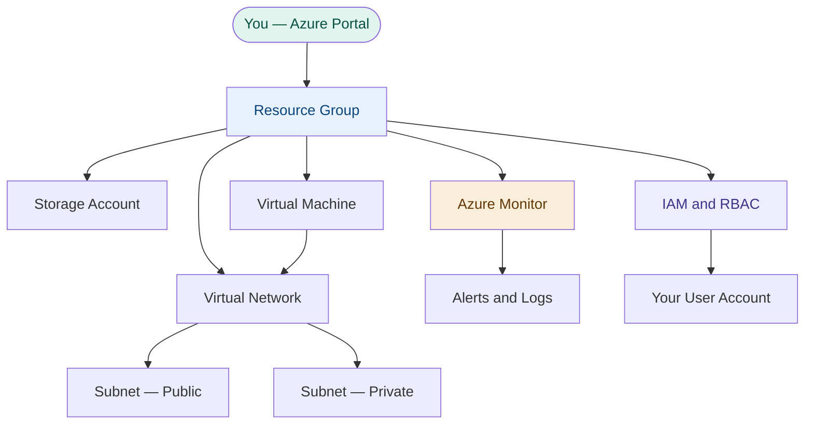

# ☁️ Azure Beginners Lab

> **Hands-on Azure labs for people starting from zero.**  
> Built by a Microsoft Support Engineer with 2.5 years of real-world experience.

[](LICENSE)
[](labs/)
[]()
[]()

---

## 👋 If you're new, start here

Never used Azure before? That's exactly who this is for.

**Before you do anything else:**
1. Create a free Azure account → https://azure.microsoft.com/free
2. Open the Azure Portal → https://portal.azure.com
3. Start with [Lab 01 — Create a Resource Group](labs/01-create-resource-group/)
4. Each lab builds on the last — do them in order

> 💡 Every lab uses **free tier resources** or costs less than $0.10.  
> Each lab includes a cleanup step so you never get charged.

---

## 🗺️ Architecture — what you'll build

By the end of all 8 labs, you'll have built this:



**In plain English:** You'll create a container for your cloud resources,
add storage, a virtual machine, a private network, monitoring,
and user permissions — the same building blocks used in real companies.

---

## 📋 Labs overview

| # | Lab | Topic | Time | Cost |
|---|-----|-------|------|------|
| 01 | [Create a Resource Group](labs/01-create-resource-group/) | Azure fundamentals | 10 min | Free |
| 02 | [Storage Account Basics](labs/02-storage-account-basics/) | Blob storage | 15 min | ~$0.01 |
| 03 | [Deploy a Virtual Machine](labs/03-azure-vm-deploy/) | Compute | 20 min | ~$0.05 |
| 04 | [VNets and Subnets](labs/04-vnet-and-subnets/) | Networking | 20 min | Free |
| 05 | [Azure Monitor Basics](labs/05-azure-monitor-basics/) | Observability | 15 min | Free |
| 06 | [RBAC and IAM](labs/06-rbac-and-iam/) | Identity | 15 min | Free |
| 07 | [Cost Management](labs/07-cost-management/) | FinOps | 10 min | Free |
| 08 | [Azure CLI Basics](labs/08-azure-cli-basics/) | Automation | 20 min | Free |

**Total estimated time:** ~2 hours  
**Total estimated cost:** Under $0.10 (and you'll clean up as you go)

---

## ✅ Prerequisites

You need exactly two things:

- [ ] A **free Azure account** — [Create one here](https://azure.microsoft.com/free) (credit card required but not charged)
- [ ] A **web browser** — Chrome, Edge, or Firefox all work

That's it. No coding experience, no software to install.

---

## ⚠️ Important — avoid charges

Every lab ends with a **cleanup section** that deletes what you created.  
Always complete the cleanup step. If you forget:

1. Go to https://portal.azure.com
2. Search for **Resource Groups**
3. Delete any resource group starting with `lab-`

---

## 🗂️ Repo structure

```
azure-beginners-lab/
├── labs/
│   ├── 01-create-resource-group/
│   ├── 02-storage-account-basics/
│   ├── 03-azure-vm-deploy/
│   ├── 04-vnet-and-subnets/
│   ├── 05-azure-monitor-basics/
│   ├── 06-rbac-and-iam/
│   ├── 07-cost-management/
│   └── 08-azure-cli-basics/
├── diagrams/
├── README.md
└── CONTRIBUTING.md
```

---

## 🙋 Troubleshooting

| Problem | Fix |
|---------|-----|
| "I don't see my resource" | Check the Subscription dropdown at the top of the Portal |
| "Permission denied" | You may need Owner role — see Lab 06 |
| "I got charged" | See Lab 07 on Cost Management, and delete unused resources |
| "The portal looks different" | Azure updates its UI often — the steps still work, just look around |

---

## 🤝 Contributing

Found an error? Have a suggestion? See [CONTRIBUTING.md](CONTRIBUTING.md).  
All skill levels welcome — even fixing a typo helps!

---

## 👤 About the author

Microsoft Support Engineer · 2.5 years helping real customers with real Azure problems  
BA Economics & Accounting · BS Computer Networks · MS Computer Networks & Cybersecurity

**⭐ Star this repo if it helped you learn**  
**👉 Follow [cloudwithwayden](https://github.com/waydenlee88) for weekly cloud content**
